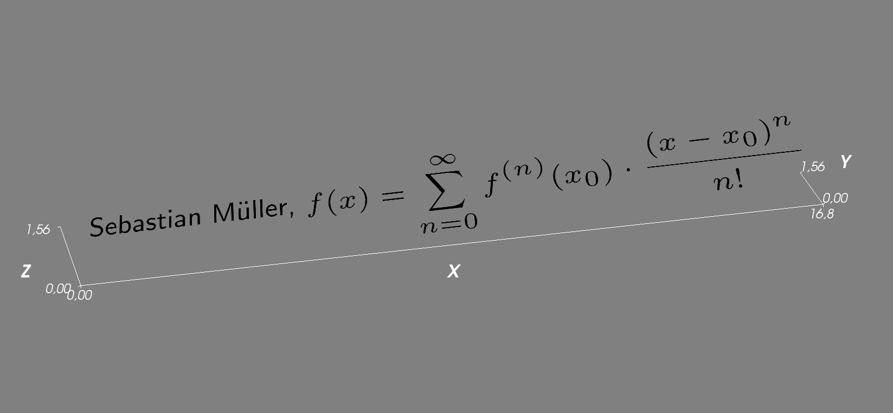

==================
mlabtex Quickstart
==================

mlabtex provides a renderer for latex code in mayavi.

Installation
============

The package can be installed via `pip <https://pypi.org/project/mlabtex/>`_.
On Windows you can install `WinPython <https://winpython.github.io/>`_ to get
Python and pip running.

.. code-block:: none

    pip install mlabtex

Further Information
===================

You can find the documention `here <https://mlabtex.readthedocs.io>`_

Functions
---------
The following functions are provided:

.. currentmodule:: mlabtex

.. autosummary::

   render_latex
   mlabtex
   mlabimg

Example
-------
You can use it like the mlab.surf routine:

.. code-block:: python

    from mayavi import mlab
    from mlabtex import mlabtex

    text = (
        r'Sebastian M\"uller, '
        + r'$f(x)=\displaystyle\sum_{n=0}^\infty '
        + r'f^{(n)}(x_0)\cdot\frac{(x-x_0)^n}{n!}$'
    )
    tex = mlabtex(
        0., 0., 0.,
        text,
        color=(0., 0., 0.),
        orientation=(30., 0., 0.),
        dpi=1200,
    )
    mlab.axes()
    mlab.show()

Requirements
============

- `NumPy >= 1.14.5 <https://www.numpy.org>`_
- `Mayavi >= 4.5.0 <https://docs.enthought.com/mayavi/mayavi/>`_

For rendering
-------------

- `matplotlib <https://matplotlib.org/>`_
- `sympy <https://www.sympy.org/>`_

License
=======

`MIT <https://github.com/MuellerSeb/mlabtex/blob/master/LICENSE>`_ © 2019
